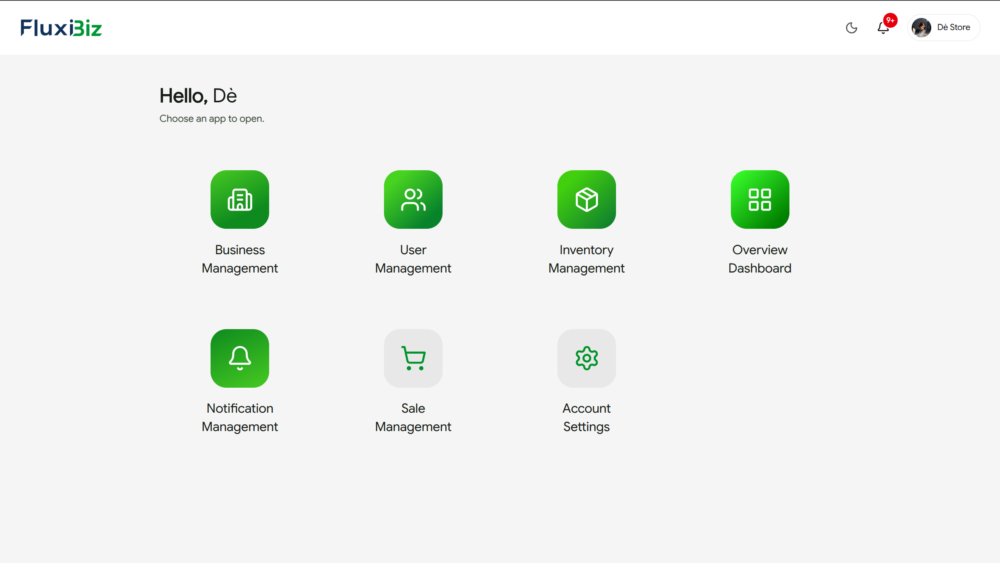
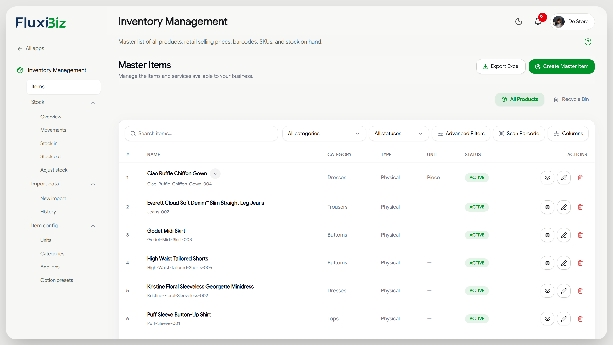
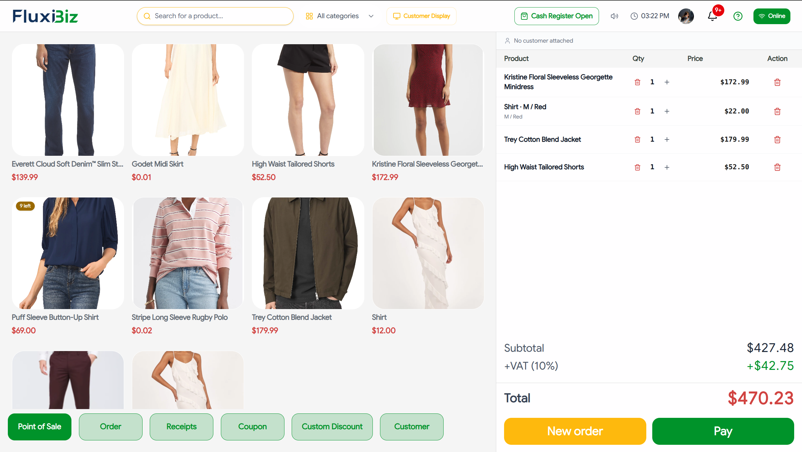

# FluxiBiz — Business Dashboard

<p align="center">
  
</p>

<p align="center"><b>Run your whole business from one screen.</b></p>

FluxiBiz is an all-in-one point-of-sale, inventory, e-commerce, and business management platform built to centralize and automate the entire lifecycle of modern business operations — across digital and physical marketplaces — for growing teams in Cambodia and beyond.

## What is FluxiBiz?

Most small and medium businesses juggle separate tools for selling in-store, selling online, tracking stock, and managing staff. FluxiBiz replaces that patchwork with a single platform:

- **Point of Sale (POS)** — process in-store sales, manage checkout, and track transactions in real time.
- **Inventory Management** — keep stock levels synced across every sales channel automatically.
- **Online Storefront / E-commerce Marketplace** — give every business a public storefront to sell directly to customers.
- **Business Management** — manage staff, stores, sales channels, and platform resources from one dashboard.

This repository is the **Business Dashboard** — the merchant-facing app owners and staff use to run POS operations, manage inventory, track sales, and configure their business. It works alongside the public storefront to give every business a complete, end-to-end platform.

## Live Demo

🔗 **[fluxibiz.store](https://fluxibiz.store)** — browse live stores, or [register a business](https://fluxibiz.store/register/business) to try the platform yourself.

## Features

- **Point of Sale (POS)** — dedicated register terminal for fast in-store checkout
  - Cash register open/close sessions and pay-later support
  - PIN-based staff login and customer-facing display for live order status
  - Barcode support, receipt printing, and offline order queueing
- **Inventory Management** — track stock across every channel
  - Item catalog, categories, stock adjustments, and bulk import
  - Per-channel item availability and sale pricing configuration
- **Sales & Orders** — manage the full sales lifecycle
  - Orders, customers, discounts, taxes, and membership types
  - Sales channel management (in-store, storefront, Telegram, Facebook)
- **Business Management** — configure the business from one place
  - Business profile, currency, payment settings, and social channel integrations
  - Employee accounts, roles, and permissions
- **Analytics & Prediction** — understand and forecast the business
  - Sales analytics dashboards and demand/stock prediction
- **Subscription & Billing** — manage the business's platform plan
- **Payments** — checkout and payment configuration, including Bakong integration
- **User Accounts** — staff and owner profiles, authenticated flows
  - Keycloak-backed OAuth login/session
  - Profile editing and picture management
- **Real-time Updates** — STOMP/WebSocket notifications for order/payment status
- **Offline Support** — offline order queueing with background sync, network status detection
- **PWA** — installable, offline-capable app with push notifications

---

## Platform Preview
<p align="center">
  
  
  
</p>

## Docs & Links

- [Scalar API Docs](https://sb-ite-basic-course-api-production.up.railway.app/scalar)
- [Download OpenAPI Document ( JSON )](./public/api-document/api.json)
- [Download OpenAPI Document ( YAML )](./public/api-document/api.yaml)

## Getting Started (Developers)

Prerequisites: Node.js v18+
Package manager: **npm** (see `package-lock.json`)

```bash
git clone <repo-url> && cd ipos-business-dashboard
npm install
# create .env.local (see Environment Variables below)
npm run dev    # start dev server — open http://localhost:3000
npm run build  # production build
npm run start  # serve the production build
npm run lint   # run ESLint
```

## Project Structure

```
.
├── public/                     # Static assets (images, icons, ...)
├── src/
│   ├── app/                    # Next.js App Router — pages & routes
│   │   ├── (auth)/             # Login & OAuth callback
│   │   ├── (dashboard)/        # Business dashboard — analytics, inventory, sales, business, employees, ...
│   │   │   ├── analytics/      # Sales analytics
│   │   │   ├── business/       # Business profile, currency, payments, channels
│   │   │   ├── dashboard/      # Home overview
│   │   │   ├── employees/      # Staff management
│   │   │   ├── inventory/      # Items, categories, stock, import
│   │   │   ├── notifications/  # Notification center
│   │   │   ├── prediction/     # Demand/stock prediction
│   │   │   ├── profile/        # Account management
│   │   │   ├── sales/          # Orders, customers, discounts, taxes, POS sessions
│   │   │   ├── settings/       # App settings
│   │   │   └── subscription/   # Plan & billing
│   │   ├── pos/                # POS register terminal
│   │   ├── customer-display/   # Customer-facing order display
│   │   ├── public-menu/        # Public menu by store slug
│   │   ├── pwa-test/           # PWA diagnostics
│   │   ├── api/                # Route handlers (auth, health, business, sales, inventory, ...)
│   │   ├── sitemap.ts          # SEO — dynamic sitemap
│   │   ├── robots.ts           # SEO — robots.txt
│   │   ├── layout.tsx          # Root layout
│   │   └── page.tsx            # Landing redirect
│   ├── components/             # UI components, organized per feature/page
│   ├── features/               # Domain logic (order, session, ...)
│   ├── lib/                    # Shared utilities, API clients, offline/sync, POS, PWA, permissions
│   ├── hooks/                  # Shared React hooks
│   ├── schemas/                # Validation schemas
│   ├── services/               # Service layer
│   ├── types/                  # Shared TypeScript types
│   └── store/                  # Redux store & hooks
├── next.config.ts              # Next.js configuration
├── eslint.config.mjs           # ESLint configuration
├── tsconfig.json               # TypeScript configuration
├── components.json             # shadcn/ui configuration
└── package.json                # NPM dependencies and scripts
```

## Environment Variables

Create a `.env` (or `.env.local`) with the keys below.

<table width="90%">
  <thead>
    <tr>
      <th width="40%">Key</th>
      <th width="60%">Description</th>
    </tr>
  </thead>
  <tbody>
    <tr>
      <td><code>BETTER_AUTH_SECRET</code></td>
      <td>Secret used to sign/encrypt auth sessions</td>
    </tr>
    <tr>
      <td><code>BETTER_AUTH_URL</code></td>
      <td>Base URL of the auth service</td>
    </tr>
    <tr>
      <td><code>KEYCLOAK_CLIENT_ID</code></td>
      <td>Keycloak client ID used for OAuth login</td>
    </tr>
    <tr>
      <td><code>KEYCLOAK_ISSUER</code></td>
      <td>Keycloak realm issuer URL</td>
    </tr>
    <tr>
      <td><code>API_BASE_URL</code></td>
      <td>Base URL of the backend API the frontend proxies to</td>
    </tr>
    <tr>
      <td><code>NEXT_PUBLIC_WS_URL</code></td>
      <td>Web Socket endpoint: {backend_url}/ws/notifications-sockjs</td>
    </tr>
    <tr>
      <td><code>NEXT_PUBLIC_VAPID_PUBLIC_KEY</code></td>
      <td>Public VAPID key for web push notification subscriptions</td>
    </tr>
    <tr>
      <td><code>VAPID_PRIVATE_KEY</code></td>
      <td>Private VAPID key used to send web push notifications</td>
    </tr>
  </tbody>
</table>


## Errors & Troubleshooting

- 401 / 403: check Bearer token validity and scopes
- 413: request payload too large — reduce size or send in chunks
- CORS errors (browser): ensure the API allows the requesting origin or use the Scalar UI to test server-side
